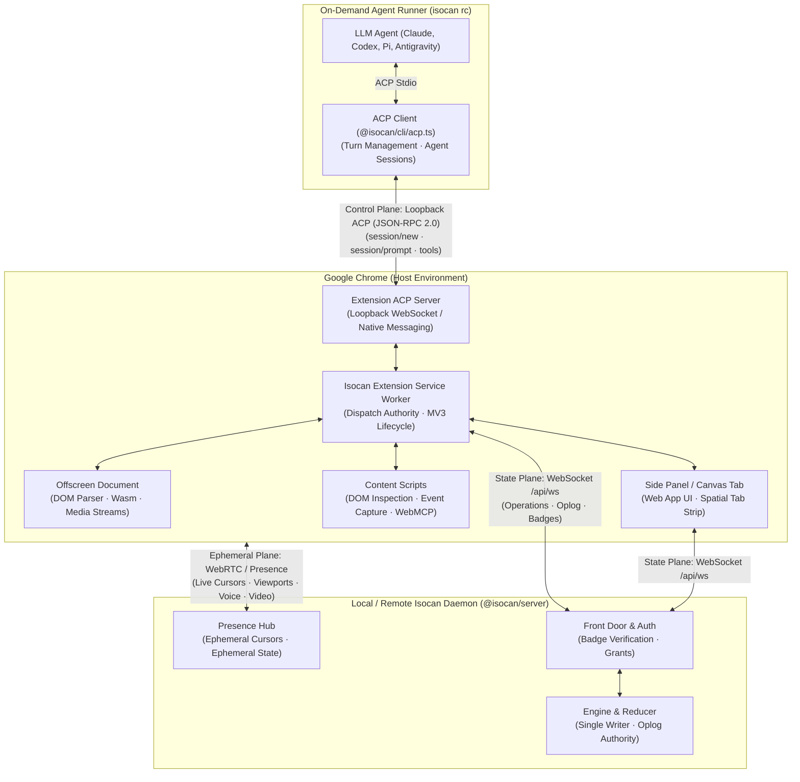

# The browser surface: architectural design

**11 September 2026.** Architectural specification for Track C (`isocan-chf`).
The companion [journey.md](journey.md) defines the user and agent experience;
[phases.md](phases.md) defines the staged walk.

The thesis in one line: **the browser is not an outside window looking at an
isocan canvas — it is an isomorphic surface and an enrolled agent speaking
the same operation vocabulary.**

---

## 1. System topography & the three planes

To eliminate authority conflation and prevent security boundaries from
collapsing into an ad-hoc RPC spaghetti, the browser surface strictly
separates concerns across three distinct planes:



### 1.1 The three planes defined

1. **The State Plane (Durable Oplog)**:
   - **Protocol**: WebSocket over `/api/ws` to the isocan daemon.
   - **Payload**: Strict `Operation` values (`packages/core/src/ops.ts`) applied
     by the single engine reducer.
   - **Authority**: Stamped with the presenting actor's badge and client ID.
   - **Durability**: Completely durable, replicated, and logged to disk/Firestore.
2. **The Control Plane (Agent Control Protocol — PROPOSED)**:
   - **Protocol**: Agent Control Protocol (ACP 1, integer protocol version 1)
     via a locally spawned adapter process (`packages/cli/src/acp.ts`) communicating
     over stdio pipes (or an extension Native Messaging host).
   - **Payload**: JSON-RPC 2.0 (`session/new`, `session/prompt`, `session/update`,
     `session/load`) matching `packages/cli/src/acp.ts`.
   - **Authority**: Governed by the active agent session grant. Turns are initiated
     by `isocan rc` prompting the agent; the agent emits updates and narration,
     executing browser actions strictly within its explicit tab grant.
   - **Status**: The ACP client in `packages/cli/src/acp.ts` is **BUILT** and tested;
     the extension-side ACP server adapter is **PROPOSED** and unimplemented.
   - **Durability**: Session-scoped; turn history preserved in ACP session handles.
3. **The Ephemeral Plane (Presence & Media)**:
   - **Protocol**: Ephemeral presence frames over `/api/ws` and direct WebRTC peer
     connections (`RTCDataChannel`, `MediaStream`).
   - **Payload**: Pointer coordinates, card viewport scroll offsets, audio tracks
     (`getUserMedia`), and screen/tab video tracks (`getDisplayMedia`).
   - **Authority**: Explicit user-gesture grants per person.
   - **Durability**: Zero disk persistence. Expires on five-minute TTL or socket
     disconnection.

---

## 2. Extension as surface vs extension as agent

A recurring trap in browser tooling is confusing an interactive UI surface with
an autonomous agent. We define both roles crisply, enforcing that both express
mutations exclusively as `@isocan/core` operations:

| Property | Extension as a Surface | Extension as an Agent |
|---|---|---|
| **Role** | Spatial canvas viewport & interactive tab strip. | Autonomous task execution & page analysis. |
| **Trigger** | Direct human gesture (click, drag, pan, middle-click). | Canvas mentions (`@browser`), scheduled alarms, or background triggers. |
| **Presentation** | Chrome Side Panel, toolbar popup, or dedicated canvas tab (`chrome-extension://.../canvas.html`). | Headless background actor wearing an avatar disc/emoji (`actor.claim`). |
| **Output Ops** | `item.add` (new tab), `item.move` (spatial layout), `item.delete` (tab closed), `thread.create` (user note). | `item.addVersion` (DOM snapshot/screenshot), `thread.reply` (task narration), `item.add` (extracted data card). |
| **Input Ops** | Replays oplog to update spatial cards, badges, and cursors. | Monitors canvas comments and item mutations for addressed turns (`reasonFor`). |
| **Invariants** | Zero autonomous background actions without human gesture. | Actions bounded by explicit session policies; never touches un-bound tabs. |

**The Law of Operations**: The extension never creates an out-of-band "private
side-channel" to mutate canvas state. If a tab is closed, it emits `item.delete`.
If an agent scrolls a page, it emits `item.update` or an ephemeral presence frame.

---

## 3. Bidirectional isomorphism specification

The relationship between browser facts and canvas operations is strictly
bidirectional:

```
┌─────────────────────────────────┐                 ┌─────────────────────────────────┐
│          Google Chrome          │                 │          Isocan Canvas          │
│                                 │                 │                                 │
│  Tab opened / Window loaded    ───► item.add    ───►  New card appears in space     │
│  Page navigated / URL changed   ───► item.addVer ───►  Card updates; history grows   │
│  Tab closed in Chrome          ───► item.delete ───►  Card moves to canvas trash    │
│  Tab grouped in Chrome         ───► item.add(area)─►  Spatial area encloses cards   │
│                                 │                 │                                 │
│  Tab brought to front / focused ◄─── focus card  ◄───  User clicks card on canvas    │
│  Tab navigated to new URL       ◄─── edit URL    ◄───  User edits card address bar  │
│  Tab closed in browser          ◄─── delete card ◄───  User hits ⌘⌫ / closes card   │
│  Tab re-opened at URL/history   ◄─── undo (⌘Z)   ◄───  User hits ⌘Z on canvas       │
│  DOM click / form fill          ◄─── agent turn  ◄───  @browser executes tool call  │
└─────────────────────────────────┘                 └─────────────────────────────────┘
```

### 3.1 Mapping Table: Browser Events $\leftrightarrow$ Operations

| Browser Event / State | Trigger Direction | Target `Operation` | Operation Payload & Details |
|---|---|---|---|
| **Tab Created** | Chrome $\rightarrow$ Canvas | `item.add` | `itemId: newId("item")`, `version: { mimeType: "text/uri-list", filename: siteFilename(url), blobHash }`, `placement: { x, y, chosen: false }`, `title: tab.title`. |
| **Tab Navigated** | Chrome $\rightarrow$ Canvas | `item.addVersion` | `itemId`, `version: { mimeType: "text/uri-list", filename, blobHash, visual?: { blobHash, mimeType: "image/png" } }`. Preserves previous URLs in the version stack; visual face holds optional screenshot thumbnail. |
| **Tab Title / Favicon Changed**| Chrome $\rightarrow$ Canvas | `item.update` | `itemId`, `patch: { title: tab.title, properties: { favicon: tab.favIconUrl } }`. |
| **Tab Closed in Chrome** | Chrome $\rightarrow$ Canvas | `item.delete` | `itemId`. Moves item to canvas trash. |
| **Tab Restored via ⌘Z** | Canvas $\rightarrow$ Chrome | `item.restore` | Restores item from trash. Extension detects restoration and invokes `chrome.tabs.create({ url, active: false })`. Note: re-opens tab at saved URL; closed forward/back session history is not preserved by Chrome. |
| **Card Selected / Focused** | Canvas $\rightarrow$ Chrome | Local UI state | User clicks card on canvas. Extension brings corresponding `tabId` to active window focus via `chrome.tabs.update(tabId, { active: true })`. |
| **Card Address Edited** | Canvas $\rightarrow$ Chrome | `item.addVersion` | User edits URL on card. Extension receives oplog entry, validates URL via `normalizeSiteUrl`, and calls `chrome.tabs.update(tabId, { url })`. |
| **Card Closed on Canvas** | Canvas $\rightarrow$ Chrome | `item.delete` | User deletes card on canvas. Extension calls `chrome.tabs.remove(tabId)`. |
| **Tab Group Created** | Chrome $\rightarrow$ Canvas | `item.add` (area) | Creates bounding `area` item enclosing grouped cards, or nests them into a child canvas item extending existing `packages/core/src/canvasitem.ts` (`properties.kind = "canvas"`, `canvasitemOf`) and the partly built `docs/projects/inception/` project. |
| **Agent Page Action** | Canvas $\rightarrow$ Chrome | Tool turn via ACP | Agent dispatches click/scroll/type. Extension executes action via CAP's accessibility/DOM tools and emits `thread.reply` with outcome. Note: oplog undo reverses canvas item state, but cannot undo arbitrary third-party web server mutations. |

---

### 3.2 Echo suppression & origin attribution

A critical trap in bidirectional synchronization is the infinite feedback loop:
1. Chrome tab navigates $\rightarrow$ Extension emits `item.addVersion`.
2. Daemon broadcasts `item.addVersion` to all clients, including the extension.
3. If the extension reacts blindly to `item.addVersion`, it commands Chrome to
   navigate to that URL again $\rightarrow$ Chrome triggers another navigation
   event $\rightarrow$ Infinite ping-pong loop.

**The Echo Suppression Rule**:
- Every operation emitted by the extension carries its unique `clientId` in the
  `OpEnvelope` (`packages/core/src/ops.ts:383`).
- When the extension receives an applied operation from the daemon's WebSocket
  feed, it inspects `envelope.clientId`.
- If `envelope.clientId === localClientId`, the extension recognizes the mutation
  as its own echoed event and suppresses re-navigating Chrome.
- In addition, programmatic navigations initiated by canvas actions set an
  ephemeral `navigatingTabIds.add(tabId)` flag in the extension so that the
  resulting Chrome `onUpdated` event is ignored rather than re-emitted to the
  canvas.

---

## 4. The seam census: CAP capabilities vs isocan needs

We build on the verified, production-tested substrate of
`chrome-agent-platform` (CAP). We audit what CAP provides out of the box and
identify the precise delta required for isocan:

| Subsystem | CAP Measured Capability (v0.3.394) | Isocan Need in Track C | Seam Resolution |
|---|---|---|---|
| **Browser Tools** | 188 granular tools declared in `extension/lib/chrome-tool-capabilities.js` (`browserTools: 138, managementTools: 50, totalTools: 188`; implementation in `browser-tools.js`) covering tabs, windows, cookies, navigation, screenshots, accessibility trees, and devtools. | High-level operations to manipulate tabs, capture visual faces, and inspect DOM nodes. | Direct reuse of CAP tool implementations inside the extension service worker. |
| **Tool Calling Protocol** | Lazy catalog protocol (`lazy-tool-protocol.js`) and pipeline execution engine (`tool-pipeline.js`, 200 step bound). | ACP (Agent Control Protocol) 1 loopback to answer `isocan rc` turns. Note: client in `packages/cli/src/acp.ts` is BUILT; extension ACP server adapter is PROPOSED. | Implement `packages/server/src/acp-bridge.ts`: bridges ACP JSON-RPC requests into CAP's internal tool dispatcher. |
| **Agent Principals** | Synthetic logical principals (`named:<slug>`, `site:<origin>`, owner-direct) with 258 dispatch routes (`docs/SW-DISPATCH-AUTHORITY-CENSUS.md`). | Isocan actors (`actor.claim`, `packages/core/src/model.ts`) with durable names, colors, and marks. | Map Isocan actor identities (`actorId`) directly to CAP's principal attribution ledger on dispatch. |
| **Approval Fences** | Strict 32 `DESTRUCTIVE_ACTIONS` requiring owner inline approval; `OWNER_DIRECT_ACTIONS` reserved for owner UI. | Explicit human-in-the-loop permission model for co-driving and autonomous agent execution. | Reuse CAP's approval store and pending cards in extension UI before executing mutating browser actions. |
| **Sandboxed Code Execution** | Manifest sandbox page (`null` origin, no `chrome.*`) with host-bridged fetch and digest-verified JS modules via import maps (`ovfm.1-3`). | Safe execution of user-authored scrapers, data transforms, and DOM visualizers. | Extension routes canvas code execution to CAP's script-sandbox host (`script-host.js`). |
| **Storage & State** | OPFS-authoritative WAL run registry (`durable-runs.js`), multi-version CAS, and owner-blob store (`cap-owner-blobs-v1/`). | Isocan daemon oplog (`ops.ts`), content-addressable blobs, and SQLite/Firestore storage. | Distinct roles: CAP stores local browser automation receipts/caches; Isocan daemon stores the collaborative canvas oplog. |

---

## 5. Authority, security & multiplayer sharing model

Sharing a browser session across a network is an extreme security boundary:
browsers hold active authentication cookies, banking credentials, OAuth refresh
tokens, and private browser history.

### 5.1 Profile Custody (The Iron Rule)

```
[ Local Chrome Profile (Owner Machine) ]
  ├── Cookies (HttpOnly, Secure)   ◄─── NEVER leaves local memory!
  ├── Password Store & Passkeys    ◄─── NEVER leaves local memory!
  ├── LocalStorage / IndexedDB     ◄─── NEVER leaves local memory!
  └── Active Session Tokens        ◄─── NEVER leaves local memory!
             │
             │ (Frame Capture / DOM Projection)
             ▼
[ Scoped Shared Canvas Card ]
  ├── Visual Face (Live WebRTC Frame / Screen Video)
  ├── Redacted DOM Tree (Passwords & Payment Fields Masked)
  ├── Synthetic Remote Input (Dispatched as Guest Actor)
  └── Audit Log & Compensating Inverse Ops (⌘Z)
             │
             │ (Oplog & Ephemeral WS)
             ▼
[ Remote Collaborator (Guest Browser) ]
  ├── Sees Live Frame & Viewport Position
  ├── Moves Presence Cursor (Color & Mark Stamped)
  └── Zero Local Cookies or Storage for the Shared Origin
```

1. **Zero Credential Transmission**:
   - Authentication cookies, passwords, passkeys, and session tokens **never**
     cross the WebSocket, **never** appear in the oplog, and **never** replicate
     to guest machines.
   - Remote guests interact via **frame projection and synthetic event
     reflection**, exactly as in remote desktop systems, but scoped to a
     single DOM tab.
   - **Distinguishing Cookie Custody Models**:
     - *CHIPS Partitioned Cookies*: Built in `packages/server/src/badges.ts:117–154`
       and `docs/projects/embed/phases.md` using `SameSite=None; Secure; Partitioned`
       so that an embedded isocan canvas iframe can maintain its own independent
       isocan badge session inside an IDE or manager.
     - *Owner-Profile Browser Authority*: In browser sharing, third-party session
       cookies and credentials belong exclusively to the owner's Chrome profile.
       Unlike canvas badge cookies, these third-party web credentials are never
       partitioned, serialized, or transmitted to peers.
   - **Visual Streaming Realism**: Visual frame streaming renders visible DOM
     text and pixels on screen (including visible account names or dashboard data).
     Sensitive password and payment fields are masked by content script heuristics,
     but visual streaming inherently exposes visible rendered text to trusted viewers.
     Cookie and session token custody is absolute (never transmitted), but visual
     data is visible. Revocation halts future event reflection and stream frames,
     but cannot undo already-dispatched remote web server mutations.
2. **Explicit, Scoped, Revocable Grants**:
   - Sharing is **per-item and per-canvas**. Sharing tab `A` grants zero visibility
     into tab `B`, even if both belong to the same browser window.
   - The owner can click "Revoke Access" at any millisecond; all active guest
     connections are terminally severed and in-flight actions dropped.
3. **Guest Roles & Permitted Actions**:
   - **Viewer**: Read-only viewport reflection. Receives visual frames and scroll
     position; cursor visible to others; cannot click, type, or navigate.
   - **Co-Driver**: Interactive collaboration. Can click links and buttons, scroll,
     and submit text into non-sensitive form inputs. Every click is rendered with
     the guest's actor color and mark (`actor.setColor`, `actor.setMark`).
   - **Agent Operator**: Can summon an enrolled agent (`@browser`) to inspect or
     operate on the page within the bounds of the owner's pre-approved tool policy.
4. **Domain Confinement & Sensitive Field Masking**:
   - **Allowlists**: Sharing is bound to an explicit origin pattern (e.g.
     `https://staging.internal.example.com/*` or `http://localhost:5173/*`).
     Any attempt by a guest or agent to navigate outside the allowlist is
     blocked by the service worker before request dispatch.
   - **Sensitive Field Shield**: Content scripts automatically detect input
     fields of type `password`, autocomplete `cc-number`, `cvc`, and fields with
     `data-private` attributes. These fields are blacked out on visual frames
     and input events targeting them are rejected for guest actors.
5. **Private Boundaries, Audit Trail & ⌘Z Undo**:
   - Every reflected click, scroll, and navigation is logged in the isocan
     envelope with the guest's `actorId`, `clientId`, and timestamp.
   - The workspace owner can hit `⌘Z` on the canvas to invert any action:
     navigating back, deleting an unwanted generated card, or closing a spawned
     tab.
6. **Per-Person Mic & Screen Sharing (Zero Ambient Grants)**:
   - Voice audio and screen sharing require **explicit browser user gestures**
     (`navigator.mediaDevices.getUserMedia`, `chrome.tabCapture`).
   - Each collaborator controls their own hardware mute and screen-cast state.
   - No ambient listening or recording: when the user navigates away or closes
     the canvas, all media tracks are explicitly stopped (`track.stop()`).
   - Media streams are strictly ephemeral (WebRTC peer connections) and are
     never stored in the persistent oplog.

---

## 6. Grounding audit: platform reality vs aspiration

In accordance with repository standards (and the precedent set by
`docs/NATIVE-AGENT-POSITION-PLAN.md`), we distinguish platform reality from
speculative aspiration across four layers:

| Capability | Shipped Platform Reality (Chrome 152 / Web) | Measured Repo Reality (CAP & isocan) | Speculative / Aspirational (Roadmap) |
|---|---|---|---|
| **MV3 Service Worker Lifecycle** | SW terminates after ~30s idle. No direct DOM or WebRTC access. | CAP WAL run outbox (`durable-runs.js`) and `bootId` survive restarts; alarms wake SW. | Indefinite background execution without offscreen document. |
| **DOM Inspection & Automation** | `chrome.debugger` (CDP) and `chrome.scripting` on explicit user grant. | CAP accessibility tree walk and 188 tools provide fast DOM extraction. | Zero-overhead direct DOM access across process boundaries. |
| **Code Sandboxing** | Manifest `sandbox.pages` (opaque `null` origin, no `chrome.*` access). | CAP script sandbox with pre-execution SHA-256 digest verification (`ovfm.1-3`). | In-SW lightweight isolates (`new Worker()` in SW). |
| **Import Map Resolution** | Dynamic import maps accepted on tested Chrome 152.0.7977.82. | Offline module resolution via `blob:` URLs in sandbox CSP (`ovfm.2`). | Standardized browser-native agent module registry. |
| **Agent Control Loopback** | External process communication via Native Messaging or WebSocket. | `packages/cli/src/acp.ts` speaks ACP 1 over stdio/WS with session load/resume. | Standardized W3C `navigator.modelContext` / `chrome.agents` native API. |
| **Tab Capture & Streaming** | `chrome.tabCapture` and `getDisplayMedia` produce MediaStreams on user gesture. | `browseritem.ts` (`text/uri-list`) projects URLs as canvas cards. | Zero-latency, multi-tenant interactive DOM remoting over WebRTC data channels. |
| **Storage & Sharing** | One OPFS root per origin; File System Access API on desktop user gesture. | OPFS multiplexing (`memory/master/`, `memory/origins/`); isocan oplog over WS. | Cloud-synced per-agent isolated storage buckets in Chrome settings. |

---

## 7. Non-goals (what this design does not do)

To preserve honesty and prevent mission creep, Track C explicitly does **not**:

1. **Invent Native Chrome APIs**: We do not assume the existence of
   `chrome.agents` or standardized native browser agent principals.
2. **Replicate Cookies Across the Network**: We never serialize, export, or
   transmit browser session cookies or master credentials to collaborators.
3. **Replace the Isocan Daemon**: The extension does not replace `@isocan/server`;
   it connects to it as an isomorphic client.
4. **Bypass MV3 Security Fences**: We do not use deprecated MV2 background pages,
   remote code injection, or un-gated host permissions.
5. **Implement Permanent Ambient Recording**: Media streams (mic and tab video)
   are never logged to the oplog; they exist solely in the ephemeral WebRTC
   transport plane.
